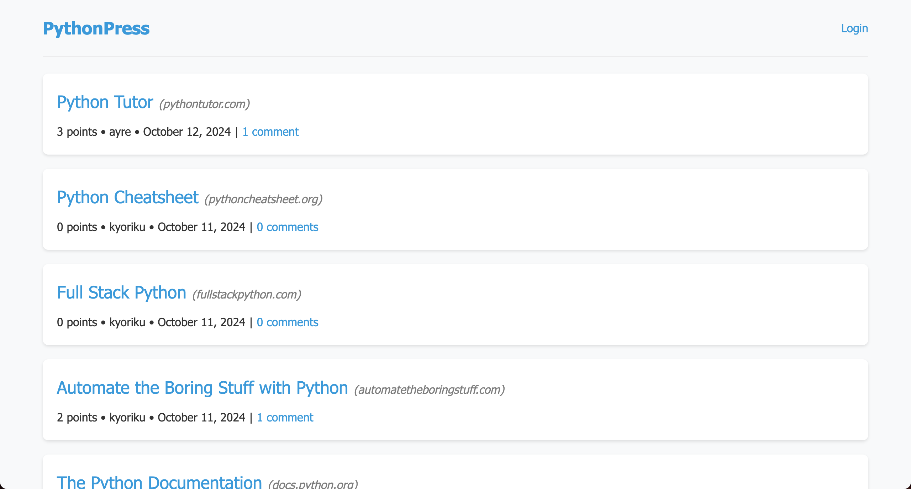
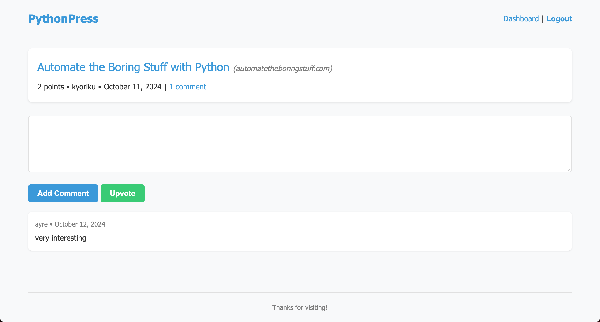
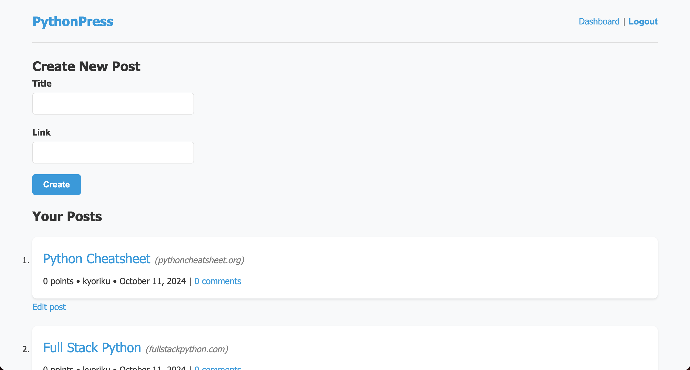
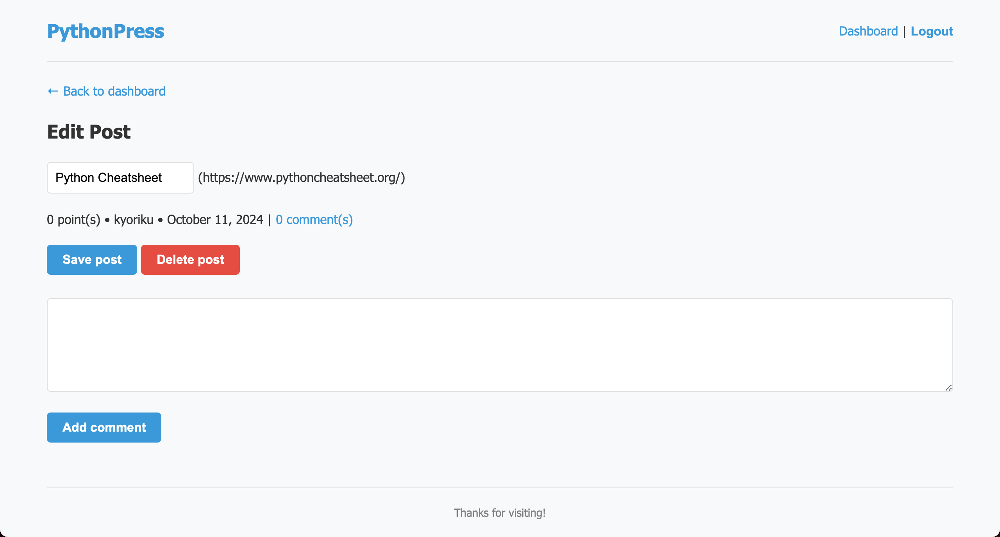

# PythonPress
*A full-stack web application built with Python and Flask that enables users to create, share, and interact with news content in a social platform format*

## Built With
[](https://www.python.org/)
[](https://flask.palletsprojects.com/en/3.0.x/)
[](https://www.sqlalchemy.org/)
[](https://jinja.palletsprojects.com/en/3.1.x/)
[](https://gunicorn.org/)
[](https://developer.mozilla.org/en-US/docs/Web/JavaScript)
[](https://developer.mozilla.org/en-US/docs/Web/CSS)

## Table of Contents
- [Description](#description)
  - [Deployed Site](#deployed-site)
- [Features](#features)
- [Screenshots](#screenshots)
- [Technical Details](#technical-details)
- [Installation](#installation)
- [Usage](#usage)
- [Contributing](#contributing)
- [License](#license)
- [Questions](#questions)

## Description
Python Newsfeed is a full-stack web application that demonstrates the power of Python web development using Flask. This platform provides a dynamic environment where users can share, discuss, and interact with news content in a social format. Built with modern Python practices and a robust SQL database backend, the application showcases the implementation of user authentication, dynamic content management, and interactive features.

The application combines secure user authentication with intuitive content management features, creating a space where users can post articles, engage in discussions through comments, and participate in content curation through upvoting. The seamless integration of SQLAlchemy with Flask provides a reliable and scalable foundation for handling user-generated content.

### Deployed Site
Visit the live website at: [https://pythonpress-64ffcf772c54.herokuapp.com](https://pythonpress-64ffcf772c54.herokuapp.com)

## Features
* **User Authentication**
  * Secure user registration and login system
  * Password hashing with bcrypt
  * Session management for logged-in users
  * Protected routes requiring authentication
  * Automatic session timeout handling

* **Content Management**
  * Create and share news posts
  * Edit existing posts through dashboard
  * Delete unwanted content
  * View post history and analytics
  * Real-time content updates

* **Interactive Features**
  * Comment on any news post
  * Upvote interesting content
  * Track user engagement metrics
  * View trending posts
  * Personalized user dashboard

* **User Interface**
  * Clean, intuitive design
  * Responsive layout
  * Dynamic content loading
  * Mobile-friendly interface
  * Cross-browser compatibility

## Screenshots
 
 
 
 

## Technical Details
This newsfeed platform was built using the following technologies and features:

* **Flask Framework**: Comprehensive web application structure:
   * Blueprint-based route organization
   * Custom decorators for route protection
   * Error handling middleware
   * Session management
   * Template rendering with Jinja2

* **Database Architecture**: SQLAlchemy ORM integration:
   * User Model: Profile and authentication data
   * Post Model: Content and metadata management
   * Comment Model: Interactive discussions
   * Vote Model: User engagement tracking
   * Relationship management between models

* **Authentication System**: Secure user management:
   * Password hashing with bcrypt
   * Session-based authentication
   * Login state persistence
   * Protected route middleware
   * CSRF protection

* **Frontend Integration**: Dynamic template system:
   * Jinja2 template inheritance
   * Responsive CSS styling
   * JavaScript interactivity
   * Form validation
   * Real-time updates

* **Security Features**: Comprehensive protection:
   * Password encryption
   * Input sanitization
   * XSS prevention
   * CSRF tokens
   * Secure session handling

## Installation
### Prerequisites:
* Python 3.x
* pip (Python package installer)
* MySQL (or another SQL database)

### Setup:
1. **Clone the Repository**
   ```bash
   git clone https://github.com/kyoriku/PythonPress.git 
   ```

2. **Navigate to the project directory**
   ```bash
   cd PythonPress
   ```

3. **Set up a virtual environment**
   ```bash
   python3 -m venv venv
   source venv/bin/activate  # for macOS/Linux
   # or
   venv\Scripts\activate  # for Windows
   ```

4. **Install dependencies**
   ```bash
   pip install -r requirements.txt
   ```

5. **Configure environment variables**

   Create a `.env` file in the root directory with:
   ```bash
   DB_URL=mysql+pymysql://<username>:<password>@localhost/python_press_db
   ```

   *Replace `<username>` with your MySQL username, and `<password>` with your MySQL password*

6. **Initialize the database**
   ```sql
   mysql -u root -p
   CREATE DATABASE python_press_db;
   ```

## Usage
1. **Start the application**
   ```bash
   flask run
   ```

2. **Navigate to the website**
   ```bash
   http://127.0.0.1:5000
   ```

3. **Create an account to:**
   * Share and manage your posts
   * Engage with content through comments
   * Upvote interesting articles
   * Access your personal dashboard

## Contributing
Contributions are welcome! Here are ways you can help:

1. Fork the repository
2. Create a feature branch
    ```bash
    git checkout -b feature/YourFeature
    ```
3. Make your changes - this could include:
    * Adding new features
    * Improving the UI/UX
    * Optimizing database queries
    * Enhancing security
    * Bug fixes
4. Commit your changes
5. Push to your branch
6. Open a Pull Request

Please ensure your contributions:
* Follow the existing code style
* Include appropriate error handling
* Test all changes locally
* Include clear descriptions in your pull request

## License
[](https://opensource.org/licenses/MIT)

This project is licensed under the [MIT](https://opensource.org/licenses/MIT) license - see the LICENSE file for details.

## Questions
For any questions, feel free to email me at devkyoriku@gmail.com.