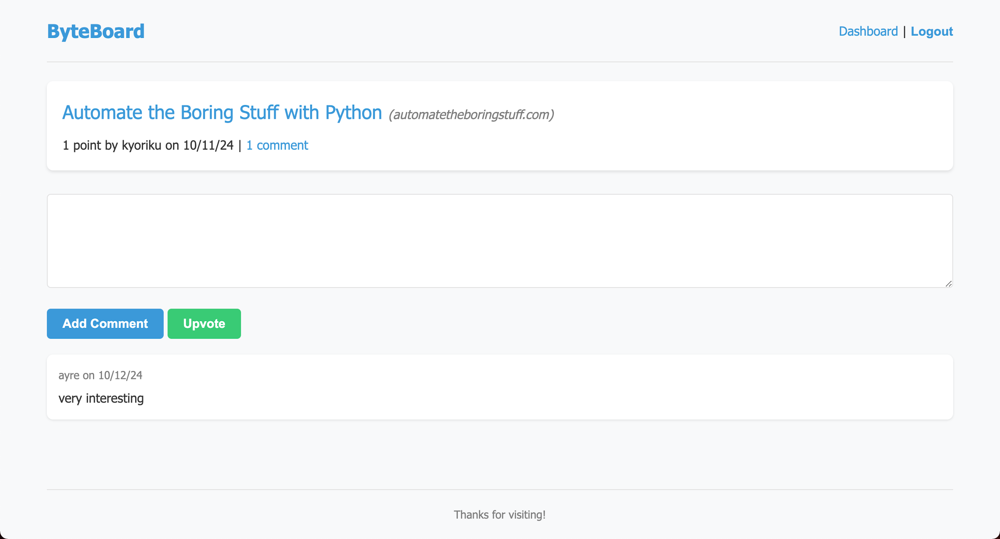
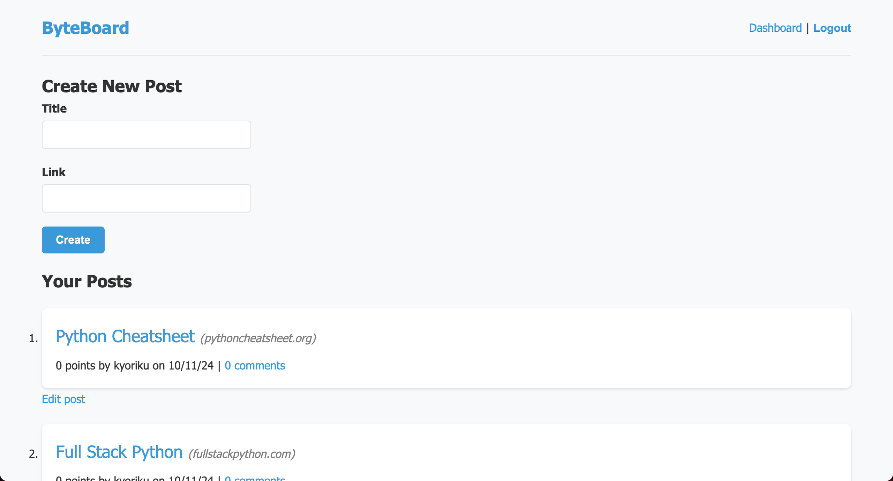

# Python Newsfeed
*A Python-based web app for creating and managing user-generated content.*

# Table of Contents
- [Description](#description)
  - [Features](#features)
  - [Purpose and Goals](#purpose-and-goals)
- [Screenshots](#screenshots)
- [Installation](#installation)
  - [Prerequisites](#prerequisites)
  - [Setup](#setup)
  - [Usage](#usage)
- [Contributing](#contributing)
- [License](#license)
- [Questions](#questions)


## Built With
[](https://www.python.org/)
[](https://flask.palletsprojects.com/en/3.0.x/)
[](https://www.sqlalchemy.org/)
[](https://jinja.palletsprojects.com/en/3.1.x/)
[](https://gunicorn.org/)
[](https://developer.mozilla.org/en-US/docs/Web/JavaScript)
[](https://developer.mozilla.org/en-US/docs/Web/HTML)
[](https://developer.mozilla.org/en-US/docs/Web/CSS)

## Description
This project is a dynamic web application built with Python and Flask that enables users to create, manage, and interact with user-generated content in a social newsfeed format. Designed for a seamless user experience, the application allows users to log in and participate in discussions by posting articles, commenting on existing posts, and engaging with content through upvotes.

### Features:
- **Home and Dashboard Rendering:** Intuitive navigation with fully functional home and dashboard pages displaying user activities like posts, comments, and upvotes.
- **User Authentication and Sessions:** Secure login with bcrypt for password hashing. Sessions persist across page refreshes for a smooth user experience.
- **Database Integration:** SQLAlchemy is used for managing user accounts, posts, comments, and upvotes, ensuring efficient data storage and retrieval.
- **Dynamic Data Views:** User posts, comments, and upvotes are displayed with properly formatted dates, URLs, and pluralized words for a clean interface.
- **Content Creation:** Logged-in users can create posts, comments, and upvote content, with changes reflected immediately.
- **Secure Routes:** Access to features like posting and commenting is restricted to authenticated users, ensuring data privacy and protection.

### Purpose and Goals:
The goal of this project is to create a user-friendly platform for sharing ideas and fostering community discussions. By focusing on user-generated content, the application encourages creativity, collaboration, and communication among its users. Whether it's sharing the latest news, discussing personal opinions, or engaging in constructive dialogue, this application provides a space for users to connect and contribute meaningfully.

## Screenshots
 
*Home page displaying latest posts*

 
*Individual post view with comments section*

 
*User dashboard showing personal posts and activity*

 
*Edit post interface for logged-in users*

## Installation

### Prerequisites:
* Python 3.x
* pip (Python package installer)
* MySQL (or another SQL database)

### Setup:
1. **Clone the Repository**
   ```bash
   git clone https://github.com/kyoriku/python-newsfeed.git 
   cd python-newsfeed
   ```

2. Set up a virtual environment (optional but recommended):
   ```bash
   python3 -m venv venv
   . venv/bin/activate
   ```

3. Install the required dependencies:
   ```bash
   pip install -r requirements.txt
   ```

4. Set up the environment variables: Create a .env file in the root directory and add the following variables:
   ```bash
   DB_URL=mysql+pymysql://<username>:<password>@localhost/python_news_db
   ```

   *Replace `<username>` with your MySQL username, replace `<password>` with your MySQL password*

5. Create the database:
   ```bash
   CREATE DATABASE python_news_db;
   ```

### Usage:
1. Run the app: 
   ```bash
   flask run
   ```

2. Access the app: Once the server is running, you can access the app by navigating to http://127.0.0.1:5000 in your browser. Check the terminal for any output messages or errors.
   
## Contributing
Feel free to open issues or submit pull requests to improve the application.

## License
[](https://opensource.org/licenses/MIT)

This project is licensed under the [MIT](https://opensource.org/licenses/MIT) license - see the LICENSE file for details.

## Questions
For any questions, feel free to email me at devkyoriku@gmail.com.